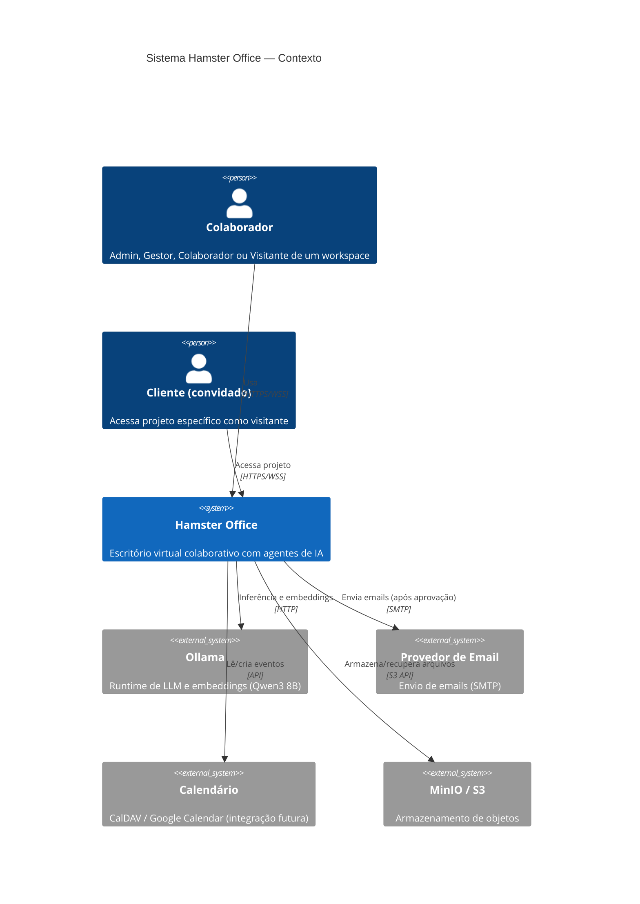
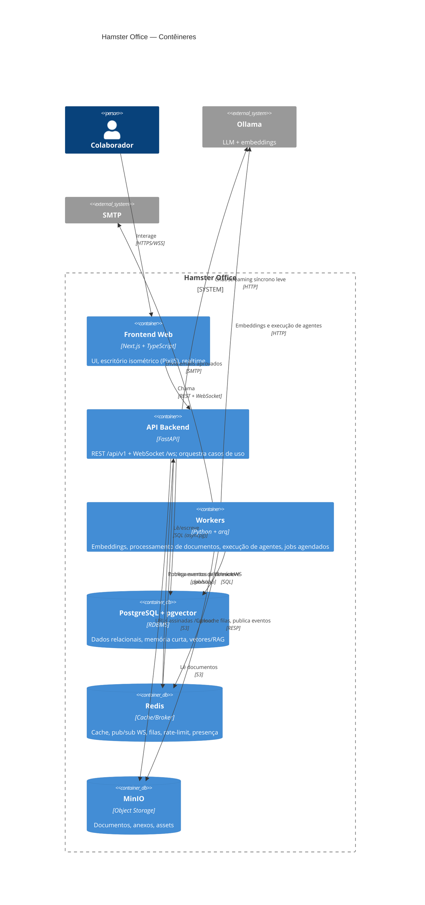
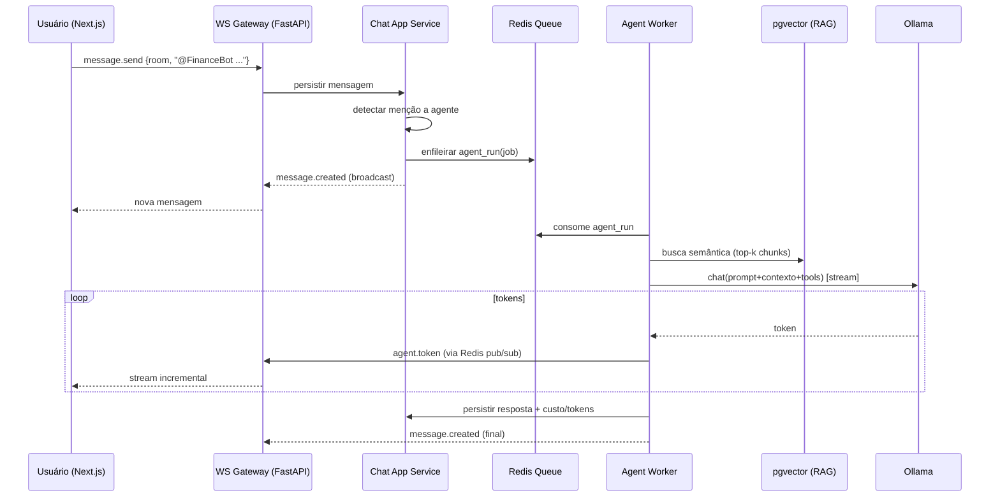
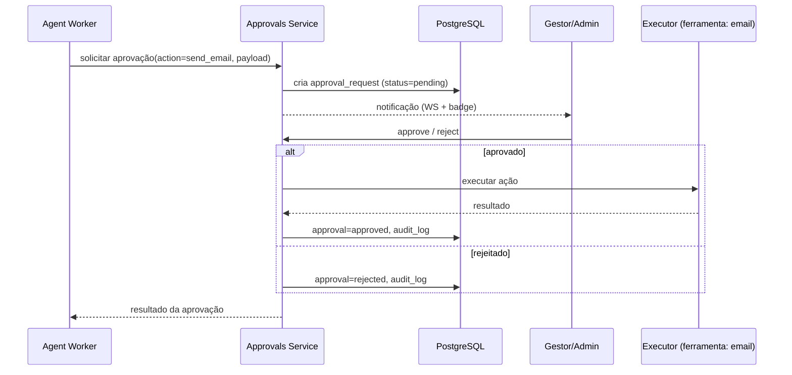

# Hamster Office — Visão Geral da Arquitetura

> Documento mestre da arquitetura. Para navegar pelos demais documentos, veja o [README](./README.md).

## 1. O que é o Hamster Office

Plataforma **SaaS multi-tenant** que materializa um "escritório virtual" no estilo
**Habbo Hotel**, onde **humanos e agentes de IA (representados como hamsters)** colaboram
em projetos, tarefas e conversas. Cada empresa/equipe é um **Workspace** isolado.

Pilares de produto:

1. **Escritório espacial 2.5D** — sala isométrica personalizável (móveis, decoração) onde
   hamsters (avatares) andam, e usuários "entram" para se reunir.
2. **Colaboração** — chat estilo Slack (canais, DMs, threads), projetos e tarefas.
3. **Agentes de IA especializados** — funcionários virtuais (comercial, financeiro, jurídico,
   dev, atendimento, analista) que conversam, criam/atualizam tarefas, consultam a base de
   conhecimento (RAG), usam ferramentas e pedem aprovação humana para ações críticas.
4. **Governança** — auditoria completa, controle de permissões, registro de custos e tokens.

## 2. Princípios de arquitetura

| # | Princípio | Implicação prática |
|---|-----------|--------------------|
| P1 | **Modular Monolith first** | Um backend FastAPI organizado em módulos com fronteiras explícitas (hexagonal). Extrai-se microserviços só quando houver dor real (agentes/embeddings são os primeiros candidatos). |
| P2 | **Domínio no centro (DDD + Hexagonal)** | Cada módulo tem `domain` (puro), `application` (casos de uso), `infrastructure` (adapters) e `presentation` (rotas/ws). Domínio não importa framework. |
| P3 | **Multi-tenant por design** | `workspace_id` em toda tabela de negócio + **Row-Level Security** no PostgreSQL. Tenant nunca depende de filtro manual esquecível. |
| P4 | **Tudo auditável** | Toda ação relevante gera evento de auditoria imutável. Ações de agentes registram custo e tokens. |
| P5 | **Human-in-the-loop** | Ações críticas de agentes passam por fila de aprovação antes de efetivar. |
| P6 | **Async-first** | Trabalho pesado (embeddings, processamento de documentos, execução de agentes) roda em workers; a API responde rápido e o realtime entrega o progresso. |
| P7 | **Realtime de primeira classe** | WebSocket para chat, presença, movimentação no escritório e streaming de tokens dos agentes. |
| P8 | **Local-first / on-prem friendly** | Ollama, PostgreSQL, Redis e MinIO rodam em Docker; sem dependência obrigatória de cloud proprietária. |
| P9 | **Contratos versionados** | REST sob `/api/v1`, eventos WS versionados, schema de banco versionado por migrations. |

## 3. Stack (consolidada)

| Camada | Tecnologia | Papel |
|--------|-----------|-------|
| Frontend | **Next.js (App Router) + TypeScript** | UI, escritório isométrico (Canvas/WebGL via PixiJS), tempo real |
| API / BFF | **FastAPI (Python 3.12)** + Pydantic v2 | REST + WebSocket, orquestração de casos de uso |
| Banco | **PostgreSQL 16 + pgvector** | Dados relacionais + memória vetorial / RAG |
| Cache & Mensageria | **Redis 7** | Cache, pub/sub para fan-out de WebSocket, broker de filas, rate-limit |
| Filas/Workers | **arq** (asyncio) sobre Redis | Embeddings, processamento de documentos, execução de agentes, jobs agendados |
| IA | **Ollama + Qwen3 8B** | LLM (chat, planejamento, relatórios) + embeddings |
| Object Storage | **MinIO** (S3-compatible) | Documentos, anexos, assets do escritório |
| Auth | **JWT (access+refresh)** + Argon2 | Autenticação stateless, refresh rotacionado |
| Observabilidade | **OpenTelemetry + Prometheus + Grafana + Loki** | Tracing, métricas, logs |
| Infra | **Docker / Docker Compose** (→ Kubernetes no futuro) | Empacotamento e orquestração |

> Decisão sobre `arq` vs `Celery`: adotamos **arq** por ser nativo asyncio (combina com FastAPI/Ollama
> que são I/O bound) e por reusar o Redis já existente. Celery permanece como alternativa se for
> necessário roteamento de filas mais sofisticado. Ver [ADR-0003](#9-decisões-arquiteturais-adrs).

## 4. Visão macro dos componentes

```
┌──────────────────────────────────────────────────────────────────────┐
│                              Navegador                                  │
│   Next.js  ─  REST (/api/v1)  ─  WebSocket (/ws)  ─  Office Renderer    │
└───────────────┬───────────────────────────────┬───────────────────────┘
                │ HTTPS / WSS                     │
        ┌───────▼────────┐                ┌───────▼────────┐
        │     Nginx       │  reverse proxy │  (TLS, gzip)   │
        └───────┬─────────┘                └────────────────┘
                │
        ┌───────▼─────────────────────────────────────────────┐
        │                FastAPI (Modular Monolith)             │
        │  auth · workspace · projects · tasks · chat · office  │
        │  documents · agents · knowledge · approvals · audit   │
        │             REST controllers + WS gateway             │
        └───┬───────────┬───────────┬──────────────┬───────────┘
            │           │           │              │
     ┌──────▼───┐ ┌─────▼────┐ ┌────▼─────┐ ┌──────▼──────┐
     │PostgreSQL│ │  Redis   │ │  MinIO   │ │   Ollama    │
     │+ pgvector│ │pub/sub+Q │ │  (S3)    │ │  Qwen3 8B   │
     └──────────┘ └─────┬────┘ └──────────┘ └──────▲──────┘
                        │ jobs                      │
                  ┌─────▼───────────────────────────┴────┐
                  │           Workers (arq)               │
                  │ embeddings · doc-processor · agent-run│
                  │        · scheduled-jobs               │
                  └───────────────────────────────────────┘
```

## 5. C4 — Nível 1: Diagrama de Contexto



## 6. C4 — Nível 2: Diagrama de Contêineres



> O diagrama C4 de **Componentes** (nível 3) está em [01-dominio.md](./01-dominio.md#diagrama-c4-componentes).

## 7. Fluxos-chave (sequências)

### 7.1 Mensagem humana → resposta de agente (com streaming e RAG)



### 7.2 Ação crítica de agente → aprovação humana



## 8. Atributos de qualidade (NFRs) e como são atendidos

| NFR | Estratégia |
|-----|-----------|
| **Multi-tenant** | `workspace_id` + RLS no Postgres; contexto de tenant resolvido por middleware. Ver [06-multi-tenant.md](./06-multi-tenant.md). |
| **Escalável** | API e workers stateless → escala horizontal; Redis pub/sub para fan-out WS entre réplicas; pgvector com índice HNSW. |
| **Auditável** | Tabela `audit.audit_log` append-only + `outbox` de eventos de domínio. |
| **Controle de permissões** | RBAC (4 papéis) + escopos por recurso; checagem em camada de aplicação + RLS no banco. |
| **Histórico completo** | Mensagens, versões de documentos, status de tarefas e execuções de agentes versionados/imutáveis. |
| **Custo por agente / tokens** | `agents.agent_run` registra `prompt_tokens`, `completion_tokens`, `cost_usd`, modelo e latência. |
| **Disponibilidade** | Health checks, retries idempotentes em jobs, dead-letter queue. |
| **Segurança** | TLS, JWT rotacionado, Argon2, URLs assinadas no MinIO, validação Pydantic, rate-limit por tenant. |

## 9. Decisões arquiteturais (ADRs)

| ADR | Decisão | Status |
|-----|---------|--------|
| ADR-0001 | **Modular Monolith** com arquitetura hexagonal por módulo | Aceito |
| ADR-0002 | **Multi-tenancy shared-schema + RLS** (`workspace_id`), com caminho para schema-per-tenant em clientes enterprise | Aceito |
| ADR-0003 | **arq** como engine de filas (asyncio sobre Redis) | Aceito |
| ADR-0004 | **WebSocket único** multiplexado por canais + Redis pub/sub para fan-out multi-réplica | Aceito |
| ADR-0005 | **PixiJS (WebGL 2D isométrico)** para o escritório, em vez de 3D real (Three.js) — estilo Habbo é 2.5D isométrico | Aceito |
| ADR-0006 | **pgvector com índice HNSW** para RAG e memória de longo prazo | Aceito |
| ADR-0007 | **Outbox pattern** para publicar eventos de domínio de forma confiável | Aceito |
| ADR-0008 | Agentes especializados via **configuração** (system prompt + tools + permissões + memória), não via modelos distintos | Aceito |

> Os ADRs completos devem residir em `docs/decisions/NNNN-titulo.md`. Aqui ficam apenas os títulos.
```

