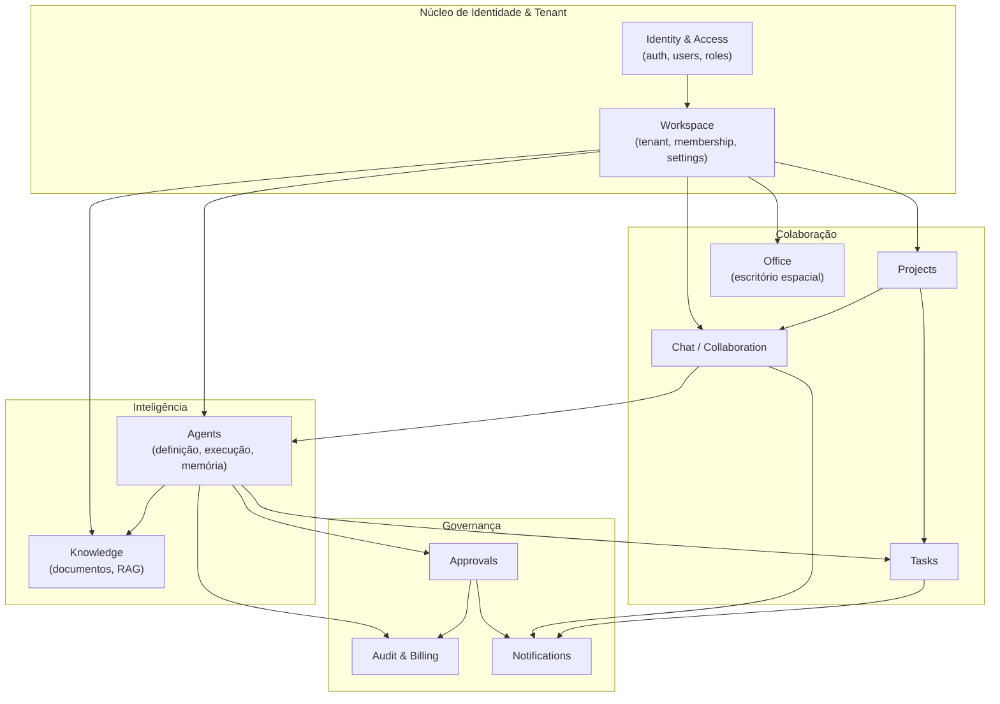
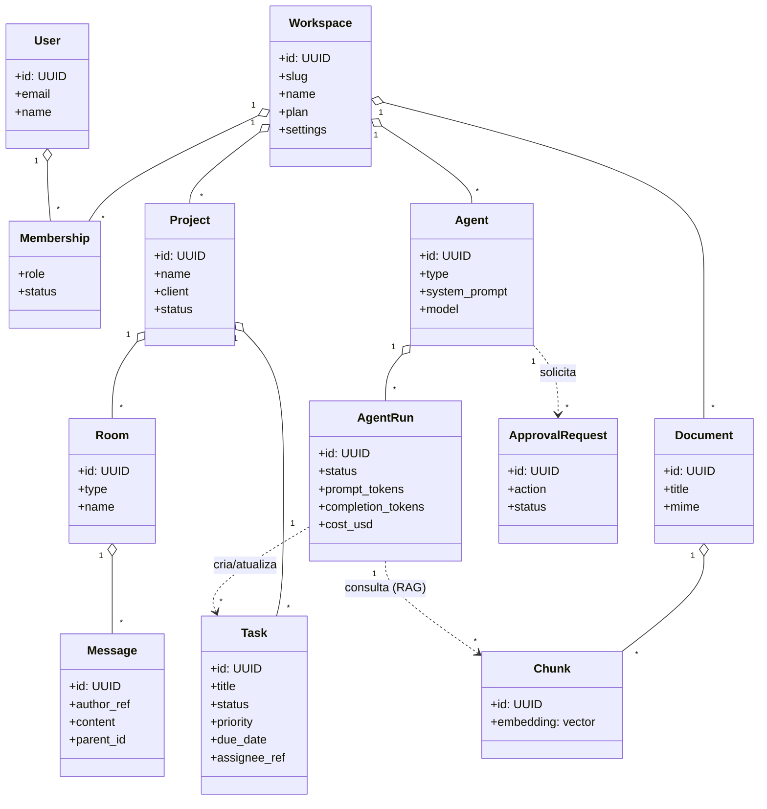
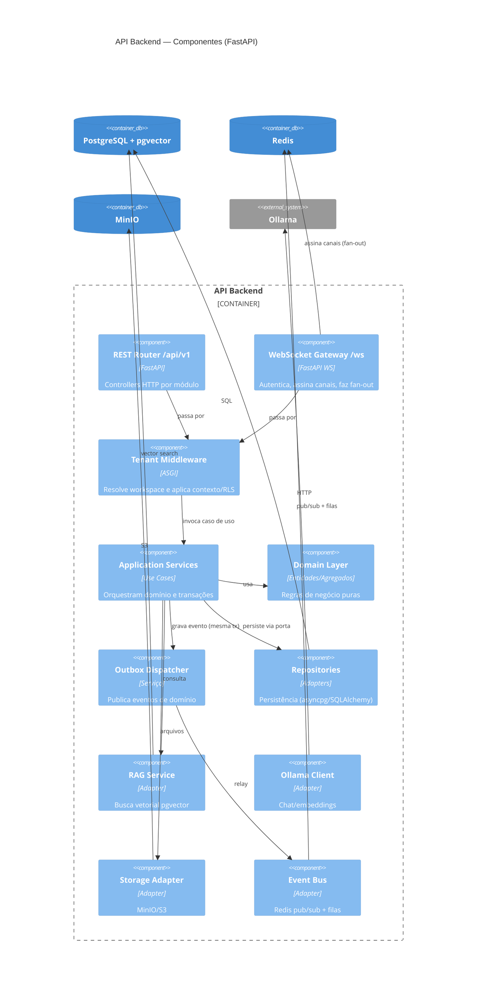

# Domínio — Bounded Contexts, Agregados e Eventos

> Modelagem estratégica (DDD). As entidades detalhadas estão em [02-entidades.md](./02-entidades.md);
> o mapeamento físico em [banco-de-dados.md](../banco-de-dados.md).

## 1. Mapa de Bounded Contexts

O sistema é dividido em **contextos delimitados**, alinhados aos schemas do PostgreSQL.
Cada contexto corresponde a um módulo do backend.



### Relações entre contextos (Context Map)

| De → Para | Padrão | Descrição |
|-----------|--------|-----------|
| IAM → Workspace | Upstream/Downstream | Identidade fornece o `user`; workspace cria a associação (membership) |
| Workspace → (todos) | Shared Kernel (`workspace_id`) | Tenant é kernel compartilhado; todo agregado carrega o tenant |
| Chat → Agents | Customer/Supplier | Chat dispara execução de agente via menção; agente devolve mensagem |
| Agents → Knowledge | Customer/Supplier | Agente consome RAG; conhecimento expõe `search()` |
| Agents → Approvals | Conformist | Agente solicita aprovação e aguarda veredito |
| (vários) → Audit | Published Language (eventos) | Todos publicam eventos de domínio que o Audit consome via outbox |
| (vários) → Notifications | Published Language (eventos) | Eventos viram notificações in-app/email |

## 2. Linguagem Ubíqua (glossário)

| Termo | Definição |
|-------|-----------|
| **Workspace** | Tenant. Representa empresa/equipe. Raiz de isolamento de dados. |
| **Member / Membership** | Vínculo de um `User` a um `Workspace` com um `Role`. |
| **Role** | `admin`, `manager`, `collaborator`, `guest`. Define permissões. |
| **Project** | Espaço de trabalho com cliente, participantes, agentes, tarefas, chats e arquivos. |
| **Task** | Unidade de trabalho: título, descrição, responsável (humano ou agente), status, prioridade, prazo. |
| **Room** | Sala de conversa: canal público, canal privado, DM ou conversa humano↔agente. |
| **Message** | Conteúdo enviado em uma room: texto, anexos, menções, resposta (thread). |
| **Agent** | Funcionário virtual configurável (persona, tools, permissões, memória). |
| **Agent Run** | Uma execução concreta de um agente (entrada, passos, custo, tokens, resultado). |
| **Tool** | Capacidade executável por um agente (consultar docs, criar tarefa, enviar email...). |
| **Document** | Arquivo na base de conhecimento (PDF, planilha, contrato...). |
| **Chunk** | Fragmento de documento vetorizado para RAG. |
| **Memory** | Memória do agente: curto prazo (histórico) e longo prazo (vetorial). |
| **Approval Request** | Pedido de autorização humana para ação crítica de agente. |
| **Avatar (Hamster)** | Representação visual de um usuário ou agente no escritório. |
| **Office Scene** | Layout espacial do escritório: grid, móveis, posições, zonas. |
| **Furniture** | Item posicionável no escritório (mesa, planta, sala de reunião...). |
| **Presence** | Estado de presença/posição em tempo real de um avatar. |
| **Audit Event** | Registro imutável de uma ação relevante. |

## 3. Agregados e invariantes

Um **agregado** é a fronteira de consistência transacional. Referências entre agregados
são sempre **por ID** (nunca objeto aninhado entre agregados distintos).

| Contexto | Agregado (raiz) | Entidades/Value Objects internos | Invariantes principais |
|----------|-----------------|-----------------------------------|------------------------|
| IAM | **User** | Credential, RefreshToken | Email único global; senha sempre hasheada (Argon2) |
| Workspace | **Workspace** | Membership, WorkspaceSettings, Invite | Slug único; ao menos 1 `admin` ativo |
| Projects | **Project** | ProjectMember, ProjectAgent, ProjectFileRef | Project pertence a 1 workspace; participante deve ser member do workspace |
| Tasks | **Task** | Subtask, TaskComment, TaskActivity | Responsável é member OU agente do projeto; transições de status válidas |
| Chat | **Room** | Participant, Message, Attachment, Reaction, ReadReceipt | DM tem exatamente 2 participantes; mensagem imutável após criada (edição = nova versão) |
| Office | **OfficeScene** | FurniturePlacement, Zone, AvatarState | Sem colisão de móveis na mesma célula; avatar dentro dos limites do grid |
| Agents | **Agent** | AgentTool, AgentPermission, AgentMemory | Agente pertence a workspace; tools habilitadas ⊆ tools permitidas pelo workspace |
| Agents | **AgentRun** | RunStep, ToolCall, TokenUsage | Run imutável após `completed/failed`; custo = Σ tokens × preço do modelo |
| Knowledge | **Document** | DocumentVersion, Chunk(+embedding) | Chunks pertencem a uma versão; embedding tem dimensão fixa do modelo |
| Approvals | **ApprovalRequest** | ApprovalDecision | Decisão só por quem tem permissão; pendente → (approved\|rejected\|expired) |
| Audit | **AuditEvent** | — (append-only) | Imutável; nunca deletado |
| Notifications | **Notification** | — | Pertence a um destinatário; idempotente por `dedup_key` |

### Diagrama de agregados (visão de domínio)



## 4. Eventos de Domínio

Eventos são publicados via **Outbox** (gravados na mesma transação do agregado e relayados
ao Redis pub/sub). Consumidores: Notifications, Audit, Office (presença), workers.

Convenção de nome: `contexto.entidade.acao` (passado). Envelope padrão:

```json
{
  "event_id": "uuid",
  "type": "chat.message.created",
  "version": 1,
  "workspace_id": "uuid",
  "occurred_at": "2026-06-02T12:00:00Z",
  "actor": { "kind": "user|agent|system", "id": "uuid" },
  "payload": { "...": "específico do evento" },
  "trace_id": "uuid"
}
```

| Contexto | Eventos |
|----------|---------|
| IAM | `iam.user.registered`, `iam.user.logged_in`, `iam.session.revoked` |
| Workspace | `workspace.created`, `workspace.member.invited`, `workspace.member.joined`, `workspace.member.role_changed`, `workspace.member.removed` |
| Projects | `project.created`, `project.member.added`, `project.agent.assigned`, `project.archived` |
| Tasks | `task.created`, `task.assigned`, `task.status_changed`, `task.commented`, `task.due_soon`, `task.completed` |
| Chat | `chat.room.created`, `chat.participant.joined`, `chat.message.created`, `chat.message.edited`, `chat.mention.created`, `chat.reaction.added` |
| Office | `office.avatar.moved`, `office.avatar.entered`, `office.avatar.left`, `office.furniture.placed`, `office.furniture.removed`, `office.scene.updated` |
| Agents | `agent.created`, `agent.run.started`, `agent.run.step`, `agent.run.token`, `agent.run.completed`, `agent.run.failed`, `agent.tool.invoked` |
| Knowledge | `knowledge.document.uploaded`, `knowledge.document.processed`, `knowledge.document.failed`, `knowledge.chunk.embedded` |
| Approvals | `approval.requested`, `approval.approved`, `approval.rejected`, `approval.expired` |
| Notifications | `notification.created` |

## 5. Casos de uso por módulo (application layer)

| Módulo | Casos de uso (verbos do negócio) |
|--------|----------------------------------|
| auth | `register`, `login`, `refresh_token`, `logout`, `request_password_reset` |
| workspace | `create_workspace`, `invite_member`, `accept_invite`, `change_role`, `update_settings`, `remove_member` |
| projects | `create_project`, `add_member`, `assign_agent`, `attach_file`, `archive_project` |
| tasks | `create_task`, `update_task`, `change_status`, `assign_task`, `comment_task`, `suggest_task` (por agente) |
| chat | `create_room`, `add_participant`, `send_message`, `edit_message`, `react`, `mark_read` |
| office | `get_scene`, `place_furniture`, `move_furniture`, `remove_furniture`, `update_avatar`, `move_avatar` |
| documents | `upload_document`, `get_download_url`, `version_document`, `delete_document` (com aprovação) |
| knowledge | `index_document`, `search` (RAG), `reindex` |
| agents | `create_agent`, `configure_agent`, `execute_agent`, `assign_agent_to_project`, `get_agent_runs` |
| approvals | `request_approval`, `approve`, `reject`, `list_pending` |
| audit | `record_event`, `query_audit`, `usage_report` (custo/tokens) |
| notifications | `notify`, `mark_read`, `list_notifications` |

## 6. Diagrama C4 — Componentes

Detalhe interno do contêiner **API Backend** (FastAPI), agrupando os módulos por camada.


