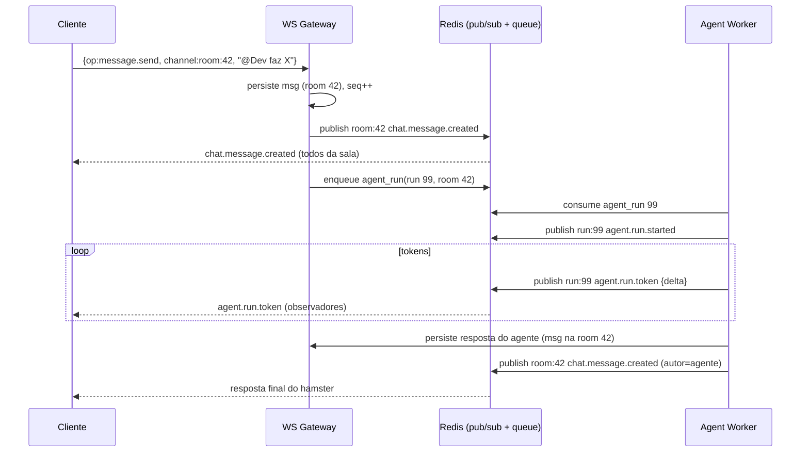

# WebSockets — Tempo Real

> Eventos em tempo real: chat, presença, escritório espacial e streaming de agentes.
> Complementa o [REST](./04-apis-rest.md). Fan-out multi-réplica via Redis pub/sub.

## 1. Conexão

- **Endpoint único multiplexado**: `wss://{host}/ws?token=<access_jwt>`
- Autenticação no handshake (JWT no query param ou subprotocol). Conexão recusada (`4401`) se inválido.
- Após conectar, o cliente **assina canais** (subscribe) relevantes; o servidor faz fan-out só do que interessa.
- Um único socket por aba; reconexão com backoff exponencial + `resume` (último `seq` recebido).

```
Cliente ──ws──▶ WS Gateway (FastAPI)
                   │  valida JWT, resolve workspace_id
                   │  registra conexão em ConnectionManager (local)
                   └─ assina canais no Redis pub/sub
Redis pub/sub ◀── publicações de qualquer réplica da API/worker
WS Gateway   ──▶ entrega aos sockets locais inscritos no canal
```

### Por que Redis pub/sub
Com N réplicas da API, um evento gerado na réplica A precisa alcançar um socket conectado na réplica B.
Cada réplica assina os canais Redis dos seus clientes; ao publicar, todas as réplicas com inscritos entregam.

## 2. Protocolo de mensagens

Envelope **cliente → servidor** (comando):
```json
{ "op": "subscribe|unsubscribe|message.send|typing|presence.move|ping",
  "channel": "room:{id}",
  "data": { },
  "client_msg_id": "uuid"   // para ack/dedup
}
```

Envelope **servidor → cliente** (evento):
```json
{ "type": "chat.message.created",
  "channel": "room:{id}",
  "seq": 12345,                 // sequência monotônica por canal (para resume)
  "ts": "2026-06-02T12:00:00Z",
  "data": { }
}
```

- `ack`: servidor responde comandos com `{ "type":"ack", "client_msg_id":"…", "ok":true }`.
- `seq` por canal permite **resume**: ao reconectar, cliente envia `{op:"subscribe", channel, after_seq}`.

## 3. Canais (channels)

| Canal | Quem assina | Conteúdo |
|-------|-------------|----------|
| `workspace:{id}` | todos os membros online | presença global, notificações broadcast |
| `room:{id}` | participantes da sala | mensagens, typing, reações, read receipts |
| `office:{scene_id}` | quem está no escritório | movimentação de avatares, móveis, entrada/saída |
| `run:{run_id}` | quem disparou/observa o agente | streaming de tokens e passos da execução |
| `user:{membership_id}` | o próprio usuário | notificações pessoais, badges, aprovações |

Autorização de subscribe: o gateway valida que o membership pertence ao workspace e é
participante da room/observador do run antes de aceitar a assinatura.

## 4. Catálogo de eventos

### 4.1 Chat (`room:{id}`)
| Tipo | Direção | Payload |
|------|---------|---------|
| `message.send` | C→S | `{ content, parent_id?, mentions[], attachments[] }` |
| `chat.message.created` | S→C | mensagem completa |
| `chat.message.edited` | S→C | `{ id, content, edited_at }` |
| `chat.typing` | C↔S | `{ member, is_typing }` |
| `chat.reaction.added` | S→C | `{ message_id, emoji, member }` |
| `chat.read` | C→S / S→C | `{ last_read_message_id }` |
| `chat.participant.joined` | S→C | `{ member }` |

### 4.2 Presença & Escritório (`office:{scene_id}`, `workspace:{id}`)
| Tipo | Direção | Payload |
|------|---------|---------|
| `presence.move` | C→S | `{ x, y, facing }` (throttle ~10 Hz no cliente) |
| `office.avatar.moved` | S→C | `{ avatar_id, x, y, facing }` |
| `office.avatar.entered` | S→C | `{ avatar_id, owner_kind, x, y }` |
| `office.avatar.left` | S→C | `{ avatar_id }` |
| `presence.status` | C→S / S→C | `{ status: online\|busy\|away }` |
| `office.furniture.placed` | S→C | `{ placement }` (após persistir via REST) |
| `office.furniture.removed` | S→C | `{ placement_id }` |

> **Estado de presença** vive em Redis: `HSET ws:{id}:presence {avatar_id} {x,y,facing,status}` com
> TTL renovado a cada `presence.move`/heartbeat. Ao expirar/desconectar → `office.avatar.left`.
> Movimentação é interpolada no cliente (path A* até a célula destino), não enviada célula a célula.

### 4.3 Streaming de Agentes (`run:{run_id}`)
| Tipo | Direção | Payload |
|------|---------|---------|
| `agent.run.started` | S→C | `{ run_id, agent_id }` |
| `agent.run.step` | S→C | `{ seq, type, tool_code?, summary }` |
| `agent.run.token` | S→C | `{ delta }` (streaming token a token) |
| `agent.run.waiting_approval` | S→C | `{ approval_request_id, action }` |
| `agent.run.completed` | S→C | `{ message_id?, total_tokens, cost_usd }` |
| `agent.run.failed` | S→C | `{ error }` |

Os tokens são publicados pelo **worker** que executa o agente diretamente no canal `run:{id}`
(via Redis), e o gateway repassa ao(s) observador(es). No escritório, o hamster do agente
exibe animação de "digitando/pensando" enquanto o run está ativo.

### 4.4 Notificações (`user:{membership_id}`)
| Tipo | Payload |
|------|---------|
| `notification.created` | `{ id, type, title, body, link }` |
| `approval.requested` | `{ approval_request_id, action, agent }` (para managers) |
| `task.assigned` | `{ task_id, title }` |

## 5. Garantias e limites

| Aspecto | Decisão |
|---------|---------|
| Entrega | At-least-once dentro da sessão; dedup por `client_msg_id`/`seq` no cliente |
| Ordenação | Por canal via `seq` monotônico (gerado no Redis com `INCR canal:seq`) |
| Resume | `subscribe { after_seq }` reentrega o gap a partir de um buffer curto (Redis Stream por canal) |
| Persistência | A verdade das mensagens é o PostgreSQL; WS é transporte. Histórico longo via REST. |
| Backpressure | Buffer por conexão com limite; cliente lento é desconectado (`1011`) e faz resume |
| Throttle | `presence.move` e `typing` limitados no cliente e validados no servidor |
| Heartbeat | `ping`/`pong` a cada 20s; idle > 60s sem pong → fecha |
| Segurança | Mesmas regras RBAC do REST aplicadas na autorização de subscribe e de comandos |

## 6. Sequência — chat com menção a agente (visão WS)


