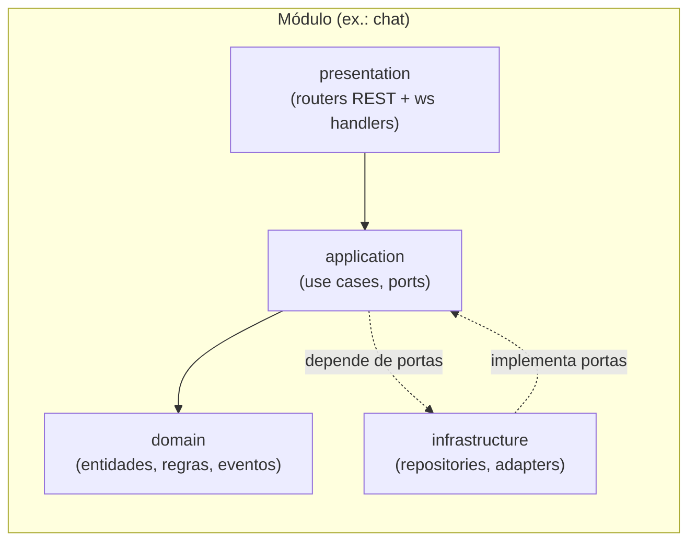

# Módulos e Estrutura de Diretórios

> Consolida e expande [estrutura-de-pastas.md](../estrutura-de-pastas.md) com a arquitetura
> hexagonal por módulo e o monorepo completo.

## 1. Visão de módulos (Modular Monolith)

O backend é **um deploy** dividido em módulos com fronteiras explícitas. Cada módulo = um
bounded context e segue a mesma arquitetura interna em 4 camadas.



**Regra de dependência (Dependency Rule):** as setas apontam para dentro.
`domain` não importa nada de framework; `application` define **portas** (interfaces) que
`infrastructure` implementa (DI por injeção no startup). Módulos se comunicam por:
- **chamadas de use case** explícitas (via interface pública do módulo), ou
- **eventos de domínio** (preferido para desacoplar — ver outbox).

> Nunca importar `infrastructure` de outro módulo nem acessar tabelas de outro schema diretamente.

## 2. Backend — estrutura de um módulo

```
backend/src/modules/<modulo>/
├── domain/
│   ├── entities.py          # agregados, value objects, invariantes
│   ├── events.py            # eventos de domínio do módulo
│   └── errors.py            # exceções de domínio
├── application/
│   ├── ports.py             # interfaces (Repository, Gateway, Bus...)
│   ├── dtos.py              # comandos/queries (Pydantic)
│   └── use_cases/           # 1 arquivo por caso de uso
├── infrastructure/
│   ├── repositories.py      # implementação SQL (asyncpg/SQLAlchemy)
│   ├── adapters.py          # MinIO, Ollama, email... conforme o módulo
│   └── mappers.py           # row <-> entidade
└── presentation/
    ├── router.py            # rotas FastAPI (/api/v1/...)
    ├── ws.py                # handlers WebSocket (se houver)
    └── schemas.py           # request/response models
```

## 3. Backend — árvore completa

```
backend/
├── pyproject.toml
├── alembic.ini
├── src/
│   ├── main.py                      # cria FastAPI app, monta routers e WS
│   ├── core/
│   │   ├── config/                  # settings (pydantic-settings, env)
│   │   ├── security/                # JWT, Argon2, RBAC, dependências de auth
│   │   ├── database/                # engine, pool, session, RLS context
│   │   ├── tenancy/                 # middleware de tenant, current_workspace
│   │   ├── events/                  # event bus, outbox dispatcher
│   │   ├── exceptions/              # handlers problem+json
│   │   ├── logging/                 # logging estruturado + OTel
│   │   └── realtime/                # ConnectionManager, Redis pub/sub
│   │
│   ├── modules/
│   │   ├── auth/
│   │   ├── workspace/
│   │   ├── projects/
│   │   ├── tasks/
│   │   ├── chat/
│   │   ├── office/
│   │   ├── documents/
│   │   ├── knowledge/
│   │   ├── agents/
│   │   ├── approvals/
│   │   ├── audit/
│   │   └── notifications/
│   │
│   ├── integrations/
│   │   ├── ollama/                  # client, models, embeddings, prompts/
│   │   ├── minio/                   # storage adapter, presigned urls
│   │   ├── email/                   # SMTP adapter
│   │   └── redis/                   # cache, pubsub, queue helpers
│   │
│   ├── workers/
│   │   ├── worker.py                # entrypoint arq (WorkerSettings)
│   │   ├── document_processor/      # extrair texto, chunk
│   │   ├── embeddings/              # gerar embeddings (Ollama) → pgvector
│   │   ├── agent_runner/            # executar agentes (loop de tools)
│   │   ├── outbox_relay/            # publica eventos pendentes no Redis
│   │   └── scheduled_jobs/          # due_soon, usage_daily, expurgos
│   │
│   └── api/
│       └── v1/                      # agregação opcional de routers (ou via modules)
│
├── migrations/                      # Alembic (schemas, tabelas, RLS, seed)
├── tests/
│   ├── unit/                        # domínio e use cases (sem I/O)
│   ├── integration/                 # repos + Postgres (testcontainers)
│   └── e2e/                         # API + WS + multi-tenant isolation
└── Dockerfile
```

## 4. Frontend — Next.js

```
frontend/
├── package.json
├── next.config.ts
├── app/                             # App Router
│   ├── (auth)/login, register
│   ├── (app)/
│   │   ├── layout.tsx               # shell autenticado + provider de WS
│   │   ├── office/                  # escritório isométrico (canvas)
│   │   ├── projects/[id]/           # tarefas, arquivos, salas do projeto
│   │   ├── chat/[roomId]/           # salas de conversa
│   │   ├── agents/                  # configuração de agentes
│   │   ├── approvals/               # fila de aprovações
│   │   └── admin/                   # dashboard administrativo (membros, billing, auditoria)
│   └── api/                         # route handlers (BFF leve, se necessário)
├── components/
│   ├── ui/                          # design system (sem cara de IA)
│   ├── office/                      # OfficeCanvas, Hamster, Furniture, Grid
│   ├── chat/                        # MessageList, Composer, Mentions
│   ├── tasks/                       # Board, TaskCard
│   └── agents/                      # AgentConfig, RunTimeline
├── hooks/
│   ├── useWebSocket.ts              # conexão única, subscribe por canal, resume
│   ├── usePresence.ts
│   └── useAgentStream.ts            # consome run:{id}
├── services/
│   ├── api/                         # cliente gerado do OpenAPI
│   └── ws/                          # protocolo de eventos (tipos compartilhados)
├── lib/office/                      # engine isométrico (PixiJS): câmera, pathfinding A*, tilemap
├── types/                           # tipos gerados + domínio
└── public/assets/                   # sprites de hamsters, móveis, pisos
```

### Engine do escritório (frontend)
- **PixiJS (WebGL 2D)** com projeção isométrica (estilo Habbo). Não usamos 3D real.
- Tilemap em grid; **pathfinding A\*** para mover o hamster até a célula clicada.
- Camada de sprites: piso → móveis (z-index por `y`) → avatares → UI (balões de chat).
- Sincronização: posições recebidas por WS são **interpoladas** (lerp/tween), não teletransportadas.
- Customização de hamster e móveis montada a partir de spritesheets + `appearance` (jsonb).

## 5. Monorepo e infraestrutura

```
hamster-office/
├── frontend/
├── backend/
├── infra/
│   ├── docker/                      # Dockerfiles auxiliares
│   ├── nginx/                       # reverse proxy, TLS, WS upgrade
│   ├── postgres/                    # init, extensões, roles
│   ├── minio/                       # buckets, políticas
│   ├── ollama/                      # modelos pré-baixados (qwen3:8b)
│   └── observability/               # prometheus, grafana, loki, otel-collector
├── docs/
│   ├── architecture/                # cópia publicável destes specs + ADRs
│   ├── api/                         # OpenAPI exportado
│   └── decisions/                   # ADR-0001..N
├── specs/                           # specs de produto/arquitetura (estes documentos)
└── docker-compose.yml               # dev: postgres, redis, minio, ollama, api, worker, web, nginx
```

> Observação: o spec original listava `agents/`, `knowledge/` e `chat/` como pastas de topo.
> Aqui eles são **módulos dentro de `backend/src/modules/`** (Modular Monolith). Caso evoluam para
> serviços próprios, a mesma estrutura hexagonal migra para um diretório de serviço sem reescrita.

## 6. Mapa módulo → schema → rotas

| Módulo | Schema DB | Prefixo REST | Canais WS |
|--------|-----------|--------------|-----------|
| auth | `auth` | `/auth` | — |
| workspace | `workspace` | `/workspaces`, `/invites` | `workspace:{id}` |
| projects | `projects` | `/projects` | — |
| tasks | `tasks` | `/tasks` | (eventos via `user:`/`workspace:`) |
| chat | `chat` | `/rooms`, `/messages` | `room:{id}` |
| office | `office` | `/office` | `office:{scene}` |
| documents | `knowledge` | `/documents` | — |
| knowledge | `knowledge` | `/knowledge` | — |
| agents | `agents` | `/agents`, `/runs` | `run:{id}` |
| approvals | `approvals` | `/approvals` | `user:{id}` |
| audit | `audit` | `/audit`, `/billing` | — |
| notifications | `notifications` | `/notifications` | `user:{id}` |

## 7. Padrões transversais

| Preocupação | Onde vive |
|-------------|-----------|
| Autenticação/RBAC | `core/security` (dependências FastAPI reutilizáveis) |
| Tenant/RLS | `core/tenancy` (middleware + `set_config` por transação) |
| Transação + Outbox | `core/database` + `core/events` (UoW grava agregado e evento juntos) |
| Eventos → WS | `core/realtime` (assina outbox→Redis, faz fan-out) |
| DI / wiring | `main.py` + `worker.py` (compõem adapters nas portas) |
| Erros | `core/exceptions` (problem+json único) |
| Observabilidade | `core/logging` + OTel middleware (trace_id propagado a jobs e eventos) |
