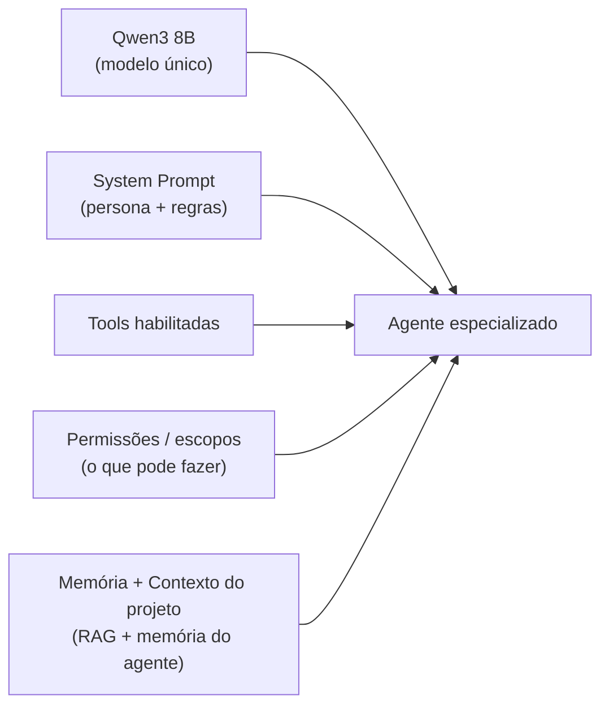
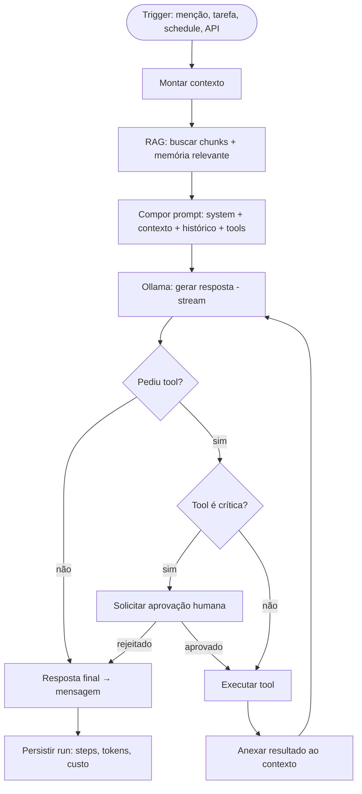
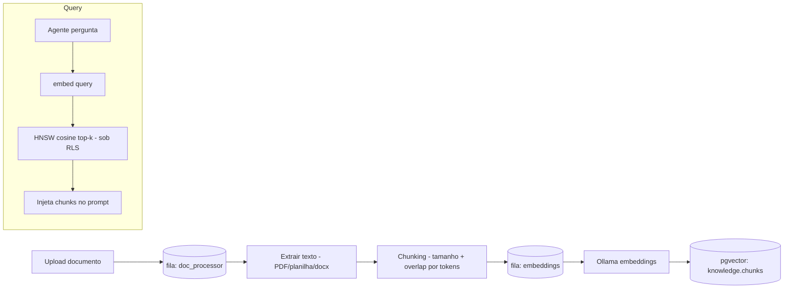
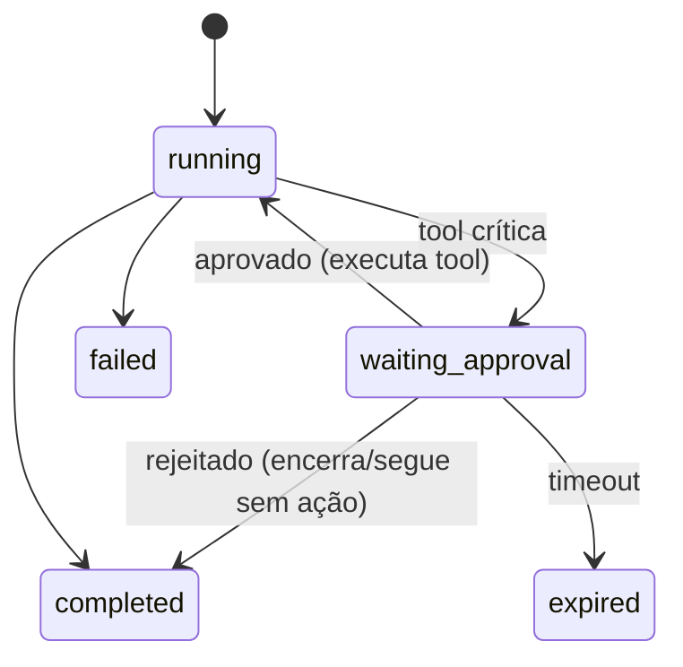

# Arquitetura de Agentes de IA

> Como os hamsters "pensam": orquestração, ferramentas (tools), memória, RAG e aprovação humana.
> Stack: Ollama + Qwen3 8B. Persistência em [agents schema](../banco-de-dados.md#47-agents).

## 1. Princípio: especialização por configuração

Todos os agentes usam **o mesmo modelo** (`qwen3:8b`) inicialmente. A diferença entre um
"Agente Financeiro" e um "Agente Jurídico" vem de **4 eixos de configuração** (ADR-0008):



Isso permite criar/ajustar agentes sem treinar modelos, e trocar o modelo base globalmente
no futuro (ex.: para um modelo maior ou fine-tuned) sem mexer na lógica.

## 2. Anatomia de uma execução (Agent Run)

Um agente roda como um **loop de raciocínio + ferramentas** (ReAct-style) dentro de um worker.



Cada iteração e tool call vira um `run_steps`; o run inteiro registra `prompt_tokens`,
`completion_tokens`, `cost_usd`, `latency_ms` para billing/auditoria.

### Composição do contexto (prompt)
1. **System prompt** do agente (persona + diretrizes + restrições de escopo).
2. **Contexto do projeto** (nome, cliente, objetivo) e da sala/tarefa de origem.
3. **Memória de curto prazo**: últimas N mensagens da conversa (do PostgreSQL).
4. **Memória de longo prazo**: top-k de `agent_memory` (vetorial) relevante à query.
5. **RAG**: top-k chunks de `knowledge.chunks` filtrados por workspace/projeto.
6. **Definição das tools** disponíveis (schema function-calling).
7. **Janela de contexto**: orçada por tokens; resumo automático quando excede (summary → memória).

## 3. Ferramentas (Tools)

Tools são capacidades executáveis, declaradas por agente (`agents.agent_tools`) e limitadas
pelas permissões do workspace (`settings.allowed_agent_tools`).

| Tool (code) | Faz | Escopo / crítico |
|-------------|-----|------------------|
| `search_kb` | Busca semântica na base de conhecimento (RAG) | leitura · não-crítico |
| `read_document` | Lê documento específico | `documents:read` · não-crítico |
| `create_task` | Cria tarefa no projeto | `tasks:write` · não-crítico |
| `update_task` | Atualiza/avança tarefa | `tasks:write` · não-crítico |
| `query_db` | Consulta read-only parametrizada (analista de dados) | `db:read` · não-crítico |
| `post_message` | Posta mensagem em sala | `chat:write` · não-crítico |
| `generate_report` | Gera relatório (markdown/arquivo) | não-crítico |
| `send_email` | Envia email | `email:send` · **crítico → aprovação** |
| `sign_document` | Assina/decide sobre documento | `docs:sign` · **crítico → aprovação** |
| `financial_op` | Operação financeira | `finance:write` · **crítico → aprovação** |
| `delete_data` | Exclui dados | `data:delete` · **crítico → aprovação** |
| `call_external_api` | Chama API REST externa | configurável · pode ser crítico |
| `calendar_event` | Lê/cria evento de calendário | integração · configurável |

**Contrato de tool** (interface no backend):
```python
class Tool(Protocol):
    code: str
    schema: dict          # JSON schema dos argumentos (function calling)
    requires_approval: bool
    async def run(self, ctx: AgentContext, args: dict) -> ToolResult: ...
```
A execução respeita RLS (o `ctx` carrega `workspace_id`), valida `args` (Pydantic) e registra o resultado.

## 4. Memória

| Tipo | Onde | Conteúdo | Uso |
|------|------|----------|-----|
| **Curto prazo** | PostgreSQL (`chat.messages`) | Histórico da conversa | Continuidade na sessão |
| **Longo prazo** | pgvector (`agents.agent_memory`) | Fatos, preferências, resumos | Recuperação semântica entre sessões |
| **Episódica** | `agents.agent_runs`/`run_steps` | O que o agente fez | Auditoria e contexto |
| **De projeto** | `projects` + `knowledge` | Conhecimento do projeto | RAG por escopo |

- **Escrita de memória**: ao fim de runs relevantes, o agente pode destilar fatos/resumos
  (`kind=fact|summary|preference`) → gera embedding → grava em `agent_memory` com `importance`.
- **Recuperação**: busca cosine top-k, com decaimento por `importance` e recência.
- **Esquecimento**: jobs reduzem `importance` ao longo do tempo; memórias irrelevantes são expurgadas.

## 5. RAG — pipeline de conhecimento



- **Chunking**: por tokens (ex.: 512 com overlap 64), preservando seções; metadados (página/seção) no `metadata`.
- **Embeddings**: modelo de embedding do Ollama (dim 1024 — ajustar ao modelo real).
- **Reindexação**: nova versão de documento re-chunka e re-embeda; versões antigas marcadas.
- **Isolamento**: toda busca roda sob RLS por `workspace_id` (+ filtro `project_id`).

## 6. Sistema de aprovação (Human-in-the-loop)

Ações críticas **pausam** o run em `waiting_approval` e criam um `approvals.requests`.



- Quem aprova: `manager`/`admin` (RBAC). Notificação via `user:{id}` + `/approvals`.
- O payload da ação (ex.: destinatário e corpo do email) é exibido **antes** de efetivar.
- Decisão registrada em `approvals.decisions` + `audit.audit_log`. Idempotente.
- Timeout configurável → `expired` (ação não ocorre).

## 7. Execução assíncrona e escala

- Agentes rodam em **workers `arq`** (fila `agent_runner`), nunca no request HTTP.
- Streaming de tokens publicado em `run:{id}` (Redis) → WS → cliente e animação do hamster.
- **Concorrência**: limite de runs simultâneos por workspace (cota) e pool de conexões ao Ollama.
- **Resiliência**: runs idempotentes por `run_id`; retry com backoff; falha → `failed` + evento.
- **Custo/tokens**: capturados do retorno do Ollama (eval counts) e convertidos via tabela de preços do modelo.

## 8. Catálogo inicial de agentes (seed)

| Agente | type | Tools típicas | Permissões críticas |
|--------|------|---------------|---------------------|
| Comercial | `commercial` | search_kb, create_task, post_message, generate_report, send_email | send_email |
| Financeiro | `finance` | search_kb, query_db, generate_report, financial_op | financial_op |
| Jurídico | `legal` | search_kb, read_document, sign_document, generate_report | sign_document |
| Analista de Dados | `data_analyst` | query_db, generate_report, search_kb | — |
| Desenvolvedor | `developer` | search_kb, create_task, update_task, call_external_api | call_external_api |
| Atendimento | `support` | search_kb, post_message, create_task, send_email | send_email |

> Cada um difere apenas em system prompt + tools + permissões + memória — mesmo modelo base.

## 9. Guardrails e segurança

- **Validação de saída**: tool calls têm args validados (Pydantic) antes de executar.
- **Escopo mínimo**: agente só acessa tools permitidas pelo workspace ∩ habilitadas no agente.
- **Sem acesso cross-tenant**: contexto e RAG sempre sob RLS.
- **Prompt-injection**: conteúdo de documentos/mensagens é tratado como dado não-confiável;
  instruções de sistema têm precedência; tools sensíveis sempre passam por aprovação.
- **Rate/budget**: corta execução ao estourar `monthly_token_budget` do workspace.
- **Auditabilidade**: todo passo, tool call e decisão é registrado e correlacionado por `trace_id`.
