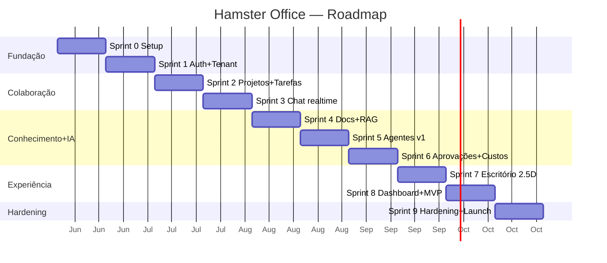

# Roadmap de Implementação (Sprints)

> Plano incremental até o MVP e além. Sprints de **2 semanas**. Cada sprint entrega algo
> demonstrável. O MVP (specs de produto) cobre: Login, Workspace, Projetos, Chats, Upload de
> documentos, Agentes especializados, Tarefas, Dashboard administrativo.

## Visão geral das fases

> Datas são ilustrativas (início sugerido após 2026-06-09). O MVP fecha ao final do Sprint 8.

---

## Sprint 0 — Fundação técnica
**Objetivo:** esqueleto rodando ponta a ponta, sem features.

- Monorepo (frontend/backend/infra), `docker-compose` (Postgres+pgvector, Redis, MinIO, Ollama, API, worker, web, nginx).
- Backend: FastAPI base, `core/` (config, database/pool, logging, exceptions, health).
- Alembic configurado; extensões (`pgcrypto`, `citext`, `vector`, `pg_trgm`); roles do banco.
- Frontend: Next.js base, design system inicial, cliente OpenAPI gerado.
- CI (lint, testes, build), pre-commit, OTel/Prometheus básicos.

**Entrega/Demo:** `/healthz` e `/readyz` verdes; página inicial conecta na API.
**DoD:** pipeline CI verde; `docker-compose up` sobe tudo.

## Sprint 1 — Autenticação + Multi-tenant
**Objetivo:** identidade e isolamento desde o início.

- Módulo `auth`: register, login, refresh rotacionado, `/auth/me`, Argon2, JWT.
- Módulo `workspace`: criar workspace, settings, **membership + RBAC (4 papéis)**, convites.
- `core/tenancy`: middleware de tenant + `set_config(app.workspace_id)` por transação.
- **RLS** habilitada nas primeiras tabelas + teste de isolamento A↔B.
- Frontend: telas de login/registro, seletor de workspace, guardas de rota por papel.

**Demo:** dois workspaces isolados; troca de workspace; papéis aplicados.
**DoD:** teste e2e prova que tenant A não lê dado de B (REST).

## Sprint 2 — Projetos + Tarefas
**Objetivo:** primeira colaboração real.

- Módulo `projects`: CRUD, membros, associação de agentes (placeholder), overview.
- Módulo `tasks`: CRUD, board por status, prioridade, prazo, atribuição, comentários, atividade.
- Eventos de domínio + **outbox** + relay para Redis (base do realtime).
- Frontend: board de tarefas (drag-and-drop), página de projeto.

**Demo:** criar projeto, gerenciar tarefas em board, histórico de atividade.
**DoD:** transições de status validadas; auditoria de tarefas registrando.

## Sprint 3 — Chat em tempo real
**Objetivo:** comunicação estilo Slack.

- Módulo `chat`: salas (canal público/privado, DM), participantes, mensagens, menções, threads, reações, read receipts.
- **WebSocket gateway** (`core/realtime`) + ConnectionManager + Redis pub/sub (fan-out multi-réplica).
- Protocolo WS (subscribe, seq, resume, ack); canais `room:{id}`, `user:{id}`, `workspace:{id}`.
- Notificações in-app (módulo `notifications`).
- Frontend: lista de salas, composer, menções, typing, presença básica.

**Demo:** duas abas conversando em tempo real, menções e notificações.
**DoD:** reconexão com resume funciona; isolamento de canal por tenant testado.

## Sprint 4 — Documentos + RAG
**Objetivo:** base de conhecimento consultável.

- Módulo `documents`: upload via presigned URL (MinIO), versões, metadados.
- Workers: `document_processor` (extração + chunking) e `embeddings` (Ollama → pgvector).
- Módulo `knowledge`: `search` (HNSW cosine, sob RLS); reindexação.
- Frontend: upload, lista/estado de indexação, busca de teste.

**Demo:** subir PDF, ver indexação assíncrona, buscar semanticamente.
**DoD:** busca retorna apenas chunks do tenant; pipeline assíncrono resiliente.

## Sprint 5 — Agentes v1 (chat + tools básicas)
**Objetivo:** hamsters que conversam e agem (sem ações críticas).

- Módulo `agents`: CRUD, configuração (system prompt, model, temperature), tools, permissões.
- Worker `agent_runner`: loop ReAct, integração Ollama (streaming), composição de contexto (histórico + RAG + memória).
- Tools não-críticas: `search_kb`, `read_document`, `create_task`, `update_task`, `post_message`, `generate_report`.
- Streaming via `run:{id}`; menção a agente no chat dispara run.
- Registro de `agent_runs`/`run_steps` (tokens, custo, latência).

**Demo:** mencionar `@FinanceBot` no chat, ver resposta em streaming usando RAG e criando uma tarefa.
**DoD:** run persiste tokens/custo; agentes especializados via configuração (seed).

## Sprint 6 — Aprovações + Custos
**Objetivo:** governança e ações críticas com human-in-the-loop.

- Módulo `approvals`: requests/decisions; tools críticas (`send_email`, `financial_op`, etc.) pausam run.
- Integração de email (SMTP) executada **somente após aprovação**.
- Billing: materialização `usage_daily`; endpoints `/billing/usage` e auditoria `/audit/events`.
- Memória de longo prazo do agente (`agent_memory`) — escrita/recuperação.
- Frontend: fila de aprovações, notificação a managers, relatório de custos.

**Demo:** agente tenta enviar email → manager aprova → email sai; dashboard de tokens/custo.
**DoD:** nenhuma ação crítica ocorre sem aprovação; custos auditáveis por agente.

## Sprint 7 — Escritório 2.5D
**Objetivo:** a identidade visual do produto.

- Módulo `office`: cena, catálogo de móveis, placements, avatares (customização).
- Frontend: engine isométrico (PixiJS), tilemap, **pathfinding A\***, sprites de hamsters e móveis.
- Presença/movimentação via WS (`office:{scene}`), estado em Redis (TTL), interpolação no cliente.
- Hamster do agente reflete estado do run (pensando/digitando).
- Editor de escritório (posicionar/remover móveis) e customização de avatar.

**Demo:** entrar no escritório, andar com o hamster, ver colegas e agentes se movendo, decorar a sala.
**DoD:** presença consistente entre clientes; sem colisão de móveis; performático.

## Sprint 8 — Dashboard administrativo + Fechamento do MVP
**Objetivo:** completar o escopo do MVP.

- Dashboard admin: membros/papéis, projetos, consumo (tokens/custo), auditoria, aprovações, settings.
- Polimento de UX (design "que não parece IA"), onboarding, estados vazios, i18n pt-BR.
- Convites por email, reset de senha, perfis.
- Testes e2e cobrindo os 8 itens do MVP.

**Demo:** jornada completa: login → workspace → projeto → chat com agentes → docs → tarefas → admin.
**DoD:** todos os itens do MVP funcionais e testados; documentação de API publicada.

## Sprint 9 — Hardening + Launch
**Objetivo:** produção.

- Segurança: pentest interno, rate-limit por tenant, revisão de RLS/permissões, secrets.
- Performance: índices, N+1, carga de WS, tuning HNSW; testes de carga.
- Observabilidade: dashboards Grafana, alertas, tracing distribuído (API↔worker↔eventos).
- Resiliência: dead-letter queues, retries idempotentes, backup/restore por tenant, runbooks.
- Deploy: imagens versionadas; caminho para Kubernetes (Helm) opcional.

**Demo:** ambiente de staging sob carga, com observabilidade e alertas.
**DoD:** SLOs definidos e medidos; checklist de produção concluído.

---

## Pós-MVP (backlog priorizado)

| Tema | Itens |
|------|-------|
| Agentes avançados | Multi-agente colaborando, planejamento de longo prazo, fine-tuning/modelos maiores, escolha de modelo por agente |
| Integrações | Google Calendar/CalDAV, webhooks, APIs externas, conectores (Drive, ERPs) |
| Escritório | Salas de reunião com áudio/vídeo, mini-games, temas/seasonais, marketplace de móveis |
| Enterprise | Schema/DB-per-tenant, SSO/SAML/OIDC, SCIM, residência de dados, auditoria avançada |
| Mobile | App ou PWA responsivo |
| Marketplace | Loja de agentes e templates de workspace |
| Analytics | Insights de produtividade, relatórios automáticos por agentes |

## Riscos e mitigações

| Risco | Mitigação |
|-------|-----------|
| Latência do Ollama/Qwen3 8B local | Streaming, fila dedicada, pool de conexões, cache de embeddings, opção de modelo maior em hardware melhor |
| Performance do escritório (muitos avatares) | Interpolação no cliente, throttle de presença, culling, limite por cena |
| Vazamento entre tenants | RLS + testes de isolamento em todo sprint (checklist do doc 06) |
| Qualidade das respostas dos agentes | RAG bem ajustado, guardrails, aprovação em ações críticas, avaliação contínua |
| Custo de tokens fora de controle | Orçamento por workspace, `usage_daily`, alertas, cortes automáticos |
| Complexidade do realtime multi-réplica | Redis pub/sub + Streams para resume; testes de reconexão |
