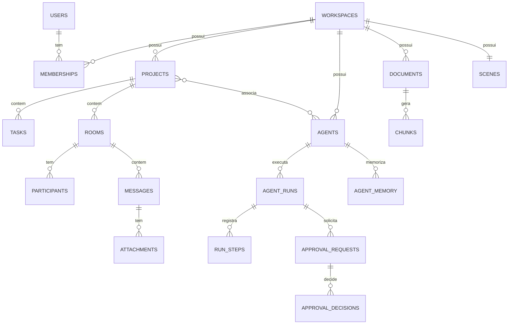

# Banco de Dados — PostgreSQL 16 + pgvector

> Modelo físico do Hamster Office. Mapeia as [entidades de domínio](./arquitetura/02-entidades.md).
> Estratégia multi-tenant detalhada em [06-multi-tenant.md](./arquitetura/06-multi-tenant.md).

## 1. Organização em schemas

Separação **por bounded context** (não por tenant — o tenant é a coluna `workspace_id` + RLS).

| Schema | Conteúdo |
|--------|----------|
| `auth` | Usuários globais, credenciais, sessões |
| `workspace` | Workspaces (tenants), membership, settings, convites |
| `projects` | Projetos e associações |
| `tasks` | Tarefas, comentários, histórico |
| `chat` | Salas, participantes, mensagens, anexos, reações |
| `office` | Cenas, móveis, avatares (hamsters) |
| `agents` | Agentes, tools, permissões, memória, execuções |
| `knowledge` | Documentos, versões, chunks (vetores) |
| `approvals` | Pedidos e decisões de aprovação |
| `audit` | Eventos de auditoria, outbox, uso/billing |
| `notifications` | Notificações |

## 2. Extensões e convenções globais

```sql
CREATE EXTENSION IF NOT EXISTS "pgcrypto";   -- gen_random_uuid()
CREATE EXTENSION IF NOT EXISTS "citext";     -- emails/slugs case-insensitive
CREATE EXTENSION IF NOT EXISTS "vector";     -- pgvector (RAG / memória)
CREATE EXTENSION IF NOT EXISTS "pg_trgm";    -- busca textual (mensagens, títulos)

-- Função de updated_at automática
CREATE OR REPLACE FUNCTION set_updated_at() RETURNS trigger AS $$
BEGIN NEW.updated_at = now(); RETURN NEW; END;
$$ LANGUAGE plpgsql;
```

**Convenções:**
- PKs `UUID` default `gen_random_uuid()` (mensagens usam UUID v7/ULID na aplicação p/ ordenação temporal).
- Toda tabela de negócio tem `workspace_id UUID NOT NULL` + RLS.
- `created_at timestamptz NOT NULL DEFAULT now()`, `updated_at` com trigger.
- Soft-delete via `deleted_at timestamptz` onde indicado; demais usam delete físico.
- FKs com `ON DELETE` explícito (CASCADE dentro do agregado; RESTRICT entre agregados).

## 3. Multi-tenancy — Row-Level Security

O contexto de tenant é injetado por transação:

```sql
-- Setado pelo middleware/repos a cada conexão/transação:
-- SELECT set_config('app.workspace_id', '<uuid>', true);

CREATE OR REPLACE FUNCTION current_workspace_id() RETURNS uuid AS $$
  SELECT NULLIF(current_setting('app.workspace_id', true), '')::uuid;
$$ LANGUAGE sql STABLE;
```

Padrão aplicado a **toda** tabela com `workspace_id` (exemplo genérico):

```sql
ALTER TABLE <schema>.<tabela> ENABLE ROW LEVEL SECURITY;
ALTER TABLE <schema>.<tabela> FORCE ROW LEVEL SECURITY;

CREATE POLICY tenant_isolation ON <schema>.<tabela>
  USING (workspace_id = current_workspace_id())
  WITH CHECK (workspace_id = current_workspace_id());
```

> A role da aplicação **não** é superuser (superuser ignora RLS). Jobs/migrations usam role
> separada com `BYPASSRLS` quando necessário. Ver [06-multi-tenant.md](./arquitetura/06-multi-tenant.md).

---

## 4. DDL por schema

### 4.1 `auth`

```sql
CREATE SCHEMA IF NOT EXISTS auth;

CREATE TABLE auth.users (
  id            uuid PRIMARY KEY DEFAULT gen_random_uuid(),
  email         citext NOT NULL UNIQUE,
  name          text   NOT NULL,
  avatar_url    text,
  password_hash text   NOT NULL,
  is_active     boolean NOT NULL DEFAULT true,
  last_login_at timestamptz,
  created_at    timestamptz NOT NULL DEFAULT now(),
  updated_at    timestamptz NOT NULL DEFAULT now()
);

CREATE TABLE auth.refresh_tokens (
  id          uuid PRIMARY KEY DEFAULT gen_random_uuid(),
  user_id     uuid NOT NULL REFERENCES auth.users(id) ON DELETE CASCADE,
  token_hash  text NOT NULL,
  user_agent  text,
  ip          inet,
  expires_at  timestamptz NOT NULL,
  revoked_at  timestamptz,
  created_at  timestamptz NOT NULL DEFAULT now()
);
CREATE INDEX ON auth.refresh_tokens (user_id) WHERE revoked_at IS NULL;
```

### 4.2 `workspace`

```sql
CREATE SCHEMA IF NOT EXISTS workspace;

CREATE TABLE workspace.workspaces (
  id            uuid PRIMARY KEY DEFAULT gen_random_uuid(),
  slug          citext NOT NULL UNIQUE,
  name          text   NOT NULL,
  plan          text   NOT NULL DEFAULT 'free'
                  CHECK (plan IN ('free','pro','enterprise')),
  owner_user_id uuid   NOT NULL REFERENCES auth.users(id) ON DELETE RESTRICT,
  status        text   NOT NULL DEFAULT 'active'
                  CHECK (status IN ('active','suspended')),
  created_at    timestamptz NOT NULL DEFAULT now(),
  updated_at    timestamptz NOT NULL DEFAULT now()
);

CREATE TABLE workspace.settings (
  workspace_id        uuid PRIMARY KEY REFERENCES workspace.workspaces(id) ON DELETE CASCADE,
  default_model       text NOT NULL DEFAULT 'qwen3:8b',
  allowed_agent_tools text[] NOT NULL DEFAULT '{}',
  monthly_token_budget bigint,
  office_theme        text NOT NULL DEFAULT 'classic',
  updated_at          timestamptz NOT NULL DEFAULT now()
);

CREATE TABLE workspace.memberships (
  id           uuid PRIMARY KEY DEFAULT gen_random_uuid(),
  workspace_id uuid NOT NULL REFERENCES workspace.workspaces(id) ON DELETE CASCADE,
  user_id      uuid NOT NULL REFERENCES auth.users(id) ON DELETE CASCADE,
  role         text NOT NULL CHECK (role IN ('admin','manager','collaborator','guest')),
  status       text NOT NULL DEFAULT 'invited'
                 CHECK (status IN ('invited','active','suspended','removed')),
  invited_by   uuid REFERENCES workspace.memberships(id),
  created_at   timestamptz NOT NULL DEFAULT now(),
  updated_at   timestamptz NOT NULL DEFAULT now(),
  UNIQUE (workspace_id, user_id)
);
CREATE INDEX ON workspace.memberships (user_id);

CREATE TABLE workspace.invites (
  id           uuid PRIMARY KEY DEFAULT gen_random_uuid(),
  workspace_id uuid NOT NULL REFERENCES workspace.workspaces(id) ON DELETE CASCADE,
  email        citext NOT NULL,
  role         text NOT NULL CHECK (role IN ('admin','manager','collaborator','guest')),
  token        text NOT NULL UNIQUE,
  expires_at   timestamptz NOT NULL,
  accepted_at  timestamptz,
  created_at   timestamptz NOT NULL DEFAULT now()
);
```

> RLS em `workspace.workspaces`: política especial — um usuário enxerga apenas workspaces onde
> tem membership ativa (subquery em `memberships`), além da regra de tenant nas demais tabelas.

### 4.3 `projects`

```sql
CREATE SCHEMA IF NOT EXISTS projects;

CREATE TABLE projects.projects (
  id                  uuid PRIMARY KEY DEFAULT gen_random_uuid(),
  workspace_id        uuid NOT NULL REFERENCES workspace.workspaces(id) ON DELETE CASCADE,
  name                text NOT NULL,
  client_name         text,
  description         text,
  status              text NOT NULL DEFAULT 'active'
                        CHECK (status IN ('active','paused','archived')),
  owner_membership_id uuid REFERENCES workspace.memberships(id),
  created_at          timestamptz NOT NULL DEFAULT now(),
  updated_at          timestamptz NOT NULL DEFAULT now(),
  deleted_at          timestamptz
);
CREATE INDEX ON projects.projects (workspace_id) WHERE deleted_at IS NULL;

CREATE TABLE projects.project_members (
  project_id    uuid NOT NULL REFERENCES projects.projects(id) ON DELETE CASCADE,
  membership_id uuid NOT NULL REFERENCES workspace.memberships(id) ON DELETE CASCADE,
  workspace_id  uuid NOT NULL,
  project_role  text NOT NULL DEFAULT 'member'
                  CHECK (project_role IN ('lead','member','viewer')),
  created_at    timestamptz NOT NULL DEFAULT now(),
  PRIMARY KEY (project_id, membership_id)
);

CREATE TABLE projects.project_agents (
  project_id   uuid NOT NULL REFERENCES projects.projects(id) ON DELETE CASCADE,
  agent_id     uuid NOT NULL,            -- FK lógica → agents.agents
  workspace_id uuid NOT NULL,
  created_at   timestamptz NOT NULL DEFAULT now(),
  PRIMARY KEY (project_id, agent_id)
);
```

### 4.4 `tasks`

```sql
CREATE SCHEMA IF NOT EXISTS tasks;

CREATE TABLE tasks.tasks (
  id              uuid PRIMARY KEY DEFAULT gen_random_uuid(),
  workspace_id    uuid NOT NULL REFERENCES workspace.workspaces(id) ON DELETE CASCADE,
  project_id      uuid NOT NULL REFERENCES projects.projects(id) ON DELETE CASCADE,
  title           text NOT NULL,
  description     text,
  status          text NOT NULL DEFAULT 'todo'
                    CHECK (status IN ('backlog','todo','in_progress','review','blocked','done','canceled')),
  priority        text NOT NULL DEFAULT 'medium'
                    CHECK (priority IN ('low','medium','high','urgent')),
  due_date        timestamptz,
  assignee_kind   text CHECK (assignee_kind IN ('user','agent')),
  assignee_id     uuid,
  created_by_kind text NOT NULL CHECK (created_by_kind IN ('user','agent','system')),
  created_by_id   uuid,
  parent_task_id  uuid REFERENCES tasks.tasks(id) ON DELETE CASCADE,
  board_order     integer NOT NULL DEFAULT 0,
  created_at      timestamptz NOT NULL DEFAULT now(),
  updated_at      timestamptz NOT NULL DEFAULT now()
);
CREATE INDEX ON tasks.tasks (project_id, status);
CREATE INDEX ON tasks.tasks (workspace_id, assignee_kind, assignee_id);
CREATE INDEX ON tasks.tasks (due_date) WHERE status NOT IN ('done','canceled');

CREATE TABLE tasks.task_comments (
  id           uuid PRIMARY KEY DEFAULT gen_random_uuid(),
  workspace_id uuid NOT NULL,
  task_id      uuid NOT NULL REFERENCES tasks.tasks(id) ON DELETE CASCADE,
  author_kind  text NOT NULL CHECK (author_kind IN ('user','agent','system')),
  author_id    uuid,
  body         text NOT NULL,
  created_at   timestamptz NOT NULL DEFAULT now()
);

CREATE TABLE tasks.task_activity (
  id           uuid PRIMARY KEY DEFAULT gen_random_uuid(),
  workspace_id uuid NOT NULL,
  task_id      uuid NOT NULL REFERENCES tasks.tasks(id) ON DELETE CASCADE,
  type         text NOT NULL,
  from_value   jsonb,
  to_value     jsonb,
  actor_kind   text NOT NULL,
  actor_id     uuid,
  created_at   timestamptz NOT NULL DEFAULT now()
);
CREATE INDEX ON tasks.task_activity (task_id, created_at);
```

### 4.5 `chat`

```sql
CREATE SCHEMA IF NOT EXISTS chat;

CREATE TABLE chat.rooms (
  id           uuid PRIMARY KEY DEFAULT gen_random_uuid(),
  workspace_id uuid NOT NULL REFERENCES workspace.workspaces(id) ON DELETE CASCADE,
  project_id   uuid REFERENCES projects.projects(id) ON DELETE CASCADE,
  type         text NOT NULL CHECK (type IN ('public_channel','private_channel','direct','human_agent')),
  name         text,
  topic        text,
  created_by   uuid REFERENCES workspace.memberships(id),
  created_at   timestamptz NOT NULL DEFAULT now(),
  updated_at   timestamptz NOT NULL DEFAULT now()
);
CREATE INDEX ON chat.rooms (workspace_id, type);

CREATE TABLE chat.participants (
  room_id               uuid NOT NULL REFERENCES chat.rooms(id) ON DELETE CASCADE,
  workspace_id          uuid NOT NULL,
  member_kind           text NOT NULL CHECK (member_kind IN ('user','agent')),
  member_id             uuid NOT NULL,
  role                  text NOT NULL DEFAULT 'member' CHECK (role IN ('owner','member')),
  muted                 boolean NOT NULL DEFAULT false,
  last_read_message_id  uuid,
  joined_at             timestamptz NOT NULL DEFAULT now(),
  PRIMARY KEY (room_id, member_kind, member_id)
);

CREATE TABLE chat.messages (
  id           uuid PRIMARY KEY,                  -- UUIDv7/ULID gerado na aplicação
  workspace_id uuid NOT NULL REFERENCES workspace.workspaces(id) ON DELETE CASCADE,
  room_id      uuid NOT NULL REFERENCES chat.rooms(id) ON DELETE CASCADE,
  author_kind  text NOT NULL CHECK (author_kind IN ('user','agent','system')),
  author_id    uuid,
  content      text NOT NULL,
  parent_id    uuid REFERENCES chat.messages(id) ON DELETE SET NULL,
  agent_run_id uuid,
  mentions     jsonb NOT NULL DEFAULT '[]',
  edited_at    timestamptz,
  created_at   timestamptz NOT NULL DEFAULT now()
);
CREATE INDEX ON chat.messages (room_id, created_at DESC);
CREATE INDEX ON chat.messages USING gin (content gin_trgm_ops);
CREATE INDEX ON chat.messages USING gin (mentions);

CREATE TABLE chat.attachments (
  id           uuid PRIMARY KEY DEFAULT gen_random_uuid(),
  workspace_id uuid NOT NULL,
  message_id   uuid NOT NULL REFERENCES chat.messages(id) ON DELETE CASCADE,
  document_id  uuid,                 -- FK lógica → knowledge.documents (se da base)
  object_key   text,                 -- senão, upload direto no MinIO
  filename     text NOT NULL,
  mime         text,
  size_bytes   bigint,
  created_at   timestamptz NOT NULL DEFAULT now()
);

CREATE TABLE chat.reactions (
  message_id   uuid NOT NULL REFERENCES chat.messages(id) ON DELETE CASCADE,
  workspace_id uuid NOT NULL,
  member_id    uuid NOT NULL,
  emoji        text NOT NULL,
  created_at   timestamptz NOT NULL DEFAULT now(),
  PRIMARY KEY (message_id, member_id, emoji)
);
```

### 4.6 `office`

```sql
CREATE SCHEMA IF NOT EXISTS office;

CREATE TABLE office.scenes (
  id           uuid PRIMARY KEY DEFAULT gen_random_uuid(),
  workspace_id uuid NOT NULL REFERENCES workspace.workspaces(id) ON DELETE CASCADE,
  name         text NOT NULL DEFAULT 'Escritório',
  grid_width   int  NOT NULL DEFAULT 20,
  grid_height  int  NOT NULL DEFAULT 20,
  theme        text NOT NULL DEFAULT 'classic',
  layout       jsonb NOT NULL DEFAULT '{}',
  created_at   timestamptz NOT NULL DEFAULT now(),
  updated_at   timestamptz NOT NULL DEFAULT now()
);

-- Catálogo global de móveis (sem tenant; sem RLS)
CREATE TABLE office.furniture_catalog (
  code       text PRIMARY KEY,
  name       text NOT NULL,
  category   text NOT NULL,
  footprint  jsonb NOT NULL DEFAULT '[[0,0]]',
  sprite_url text NOT NULL,
  created_at timestamptz NOT NULL DEFAULT now()
);

CREATE TABLE office.furniture_placements (
  id             uuid PRIMARY KEY DEFAULT gen_random_uuid(),
  workspace_id   uuid NOT NULL,
  scene_id       uuid NOT NULL REFERENCES office.scenes(id) ON DELETE CASCADE,
  furniture_code text NOT NULL REFERENCES office.furniture_catalog(code),
  x              int NOT NULL,
  y              int NOT NULL,
  rotation       int NOT NULL DEFAULT 0 CHECK (rotation IN (0,90,180,270)),
  z_index        int NOT NULL DEFAULT 0,
  created_at     timestamptz NOT NULL DEFAULT now()
);
CREATE INDEX ON office.furniture_placements (scene_id);

CREATE TABLE office.avatars (
  id           uuid PRIMARY KEY DEFAULT gen_random_uuid(),
  workspace_id uuid NOT NULL REFERENCES workspace.workspaces(id) ON DELETE CASCADE,
  owner_kind   text NOT NULL CHECK (owner_kind IN ('user','agent')),
  owner_id     uuid NOT NULL,            -- membership_id ou agent_id
  appearance   jsonb NOT NULL DEFAULT '{}',
  home_x       int NOT NULL DEFAULT 0,
  home_y       int NOT NULL DEFAULT 0,
  created_at   timestamptz NOT NULL DEFAULT now(),
  updated_at   timestamptz NOT NULL DEFAULT now(),
  UNIQUE (workspace_id, owner_kind, owner_id)
);
```

> `office.avatar_state` (posição/presença) **não** é persistida no Postgres — vive em Redis
> (`HSET ws:{id}:presence ...` + pub/sub). Persistir é opcional para "última posição".

### 4.7 `agents`

```sql
CREATE SCHEMA IF NOT EXISTS agents;

CREATE TABLE agents.agents (
  id           uuid PRIMARY KEY DEFAULT gen_random_uuid(),
  workspace_id uuid NOT NULL REFERENCES workspace.workspaces(id) ON DELETE CASCADE,
  type         text NOT NULL CHECK (type IN
                 ('commercial','finance','legal','data_analyst','developer','support','custom')),
  name         text NOT NULL,
  persona      text,
  system_prompt text NOT NULL,
  model        text NOT NULL DEFAULT 'qwen3:8b',
  temperature  numeric(3,2) NOT NULL DEFAULT 0.20,
  is_active    boolean NOT NULL DEFAULT true,
  avatar_id    uuid REFERENCES office.avatars(id),
  created_at   timestamptz NOT NULL DEFAULT now(),
  updated_at   timestamptz NOT NULL DEFAULT now()
);

CREATE TABLE agents.agent_tools (
  agent_id     uuid NOT NULL REFERENCES agents.agents(id) ON DELETE CASCADE,
  workspace_id uuid NOT NULL,
  tool_code    text NOT NULL,
  config       jsonb NOT NULL DEFAULT '{}',
  PRIMARY KEY (agent_id, tool_code)
);

CREATE TABLE agents.agent_permissions (
  agent_id          uuid NOT NULL REFERENCES agents.agents(id) ON DELETE CASCADE,
  workspace_id      uuid NOT NULL,
  scope             text NOT NULL,
  requires_approval boolean NOT NULL DEFAULT false,
  PRIMARY KEY (agent_id, scope)
);

CREATE TABLE agents.agent_memory (
  id           uuid PRIMARY KEY DEFAULT gen_random_uuid(),
  workspace_id uuid NOT NULL REFERENCES workspace.workspaces(id) ON DELETE CASCADE,
  agent_id     uuid NOT NULL REFERENCES agents.agents(id) ON DELETE CASCADE,
  project_id   uuid REFERENCES projects.projects(id) ON DELETE CASCADE,
  kind         text NOT NULL CHECK (kind IN ('fact','summary','preference')),
  content      text NOT NULL,
  embedding    vector(1024),
  importance   numeric(4,3) NOT NULL DEFAULT 0.5,
  created_at   timestamptz NOT NULL DEFAULT now()
);
CREATE INDEX ON agents.agent_memory USING hnsw (embedding vector_cosine_ops);
CREATE INDEX ON agents.agent_memory (agent_id, project_id);

CREATE TABLE agents.agent_runs (
  id               uuid PRIMARY KEY DEFAULT gen_random_uuid(),
  workspace_id     uuid NOT NULL REFERENCES workspace.workspaces(id) ON DELETE CASCADE,
  agent_id         uuid NOT NULL REFERENCES agents.agents(id) ON DELETE CASCADE,
  project_id       uuid REFERENCES projects.projects(id) ON DELETE SET NULL,
  trigger_kind     text NOT NULL CHECK (trigger_kind IN ('chat_mention','task','schedule','api')),
  trigger_ref      uuid,
  status           text NOT NULL DEFAULT 'queued'
                     CHECK (status IN ('queued','running','waiting_approval','completed','failed','canceled')),
  model            text NOT NULL,
  prompt_tokens    integer NOT NULL DEFAULT 0,
  completion_tokens integer NOT NULL DEFAULT 0,
  total_tokens     integer GENERATED ALWAYS AS (prompt_tokens + completion_tokens) STORED,
  cost_usd         numeric(12,6) NOT NULL DEFAULT 0,
  latency_ms       integer,
  error            text,
  started_at       timestamptz,
  finished_at      timestamptz,
  created_at       timestamptz NOT NULL DEFAULT now()
);
CREATE INDEX ON agents.agent_runs (workspace_id, agent_id, created_at DESC);
CREATE INDEX ON agents.agent_runs (workspace_id, status);

CREATE TABLE agents.run_steps (
  id                  uuid PRIMARY KEY DEFAULT gen_random_uuid(),
  workspace_id        uuid NOT NULL,
  run_id              uuid NOT NULL REFERENCES agents.agent_runs(id) ON DELETE CASCADE,
  seq                 integer NOT NULL,
  type                text NOT NULL CHECK (type IN ('think','tool_call','tool_result','message')),
  tool_code           text,
  input               jsonb,
  output              jsonb,
  approval_request_id uuid,
  created_at          timestamptz NOT NULL DEFAULT now(),
  UNIQUE (run_id, seq)
);
```

### 4.8 `knowledge`

```sql
CREATE SCHEMA IF NOT EXISTS knowledge;

CREATE TABLE knowledge.documents (
  id              uuid PRIMARY KEY DEFAULT gen_random_uuid(),
  workspace_id    uuid NOT NULL REFERENCES workspace.workspaces(id) ON DELETE CASCADE,
  project_id      uuid REFERENCES projects.projects(id) ON DELETE SET NULL,
  title           text NOT NULL,
  object_key      text NOT NULL,
  mime            text,
  size_bytes      bigint,
  status          text NOT NULL DEFAULT 'uploaded'
                    CHECK (status IN ('uploaded','processing','indexed','failed')),
  uploaded_by     uuid REFERENCES workspace.memberships(id),
  current_version int NOT NULL DEFAULT 1,
  created_at      timestamptz NOT NULL DEFAULT now(),
  updated_at      timestamptz NOT NULL DEFAULT now(),
  deleted_at      timestamptz
);
CREATE INDEX ON knowledge.documents (workspace_id, project_id) WHERE deleted_at IS NULL;

CREATE TABLE knowledge.document_versions (
  id          uuid PRIMARY KEY DEFAULT gen_random_uuid(),
  workspace_id uuid NOT NULL,
  document_id uuid NOT NULL REFERENCES knowledge.documents(id) ON DELETE CASCADE,
  version     int NOT NULL,
  object_key  text NOT NULL,
  checksum    text NOT NULL,
  created_at  timestamptz NOT NULL DEFAULT now(),
  UNIQUE (document_id, version)
);

CREATE TABLE knowledge.chunks (
  id           uuid PRIMARY KEY DEFAULT gen_random_uuid(),
  workspace_id uuid NOT NULL REFERENCES workspace.workspaces(id) ON DELETE CASCADE,
  document_id  uuid NOT NULL REFERENCES knowledge.documents(id) ON DELETE CASCADE,
  version      int NOT NULL,
  ord          int NOT NULL,
  content      text NOT NULL,
  token_count  int,
  embedding    vector(1024) NOT NULL,
  metadata     jsonb NOT NULL DEFAULT '{}',
  created_at   timestamptz NOT NULL DEFAULT now()
);
-- Índice ANN para RAG (cosine). HNSW: alta recall, boa latência.
CREATE INDEX ON knowledge.chunks USING hnsw (embedding vector_cosine_ops)
  WITH (m = 16, ef_construction = 64);
CREATE INDEX ON knowledge.chunks (document_id, version);
```

> **RAG com isolamento**: a busca vetorial sempre roda sob RLS (`workspace_id`), garantindo que
> um tenant nunca recupere chunks de outro. Filtro adicional por `project_id` quando aplicável.

### 4.9 `approvals`

```sql
CREATE SCHEMA IF NOT EXISTS approvals;

CREATE TABLE approvals.requests (
  id                      uuid PRIMARY KEY DEFAULT gen_random_uuid(),
  workspace_id            uuid NOT NULL REFERENCES workspace.workspaces(id) ON DELETE CASCADE,
  agent_run_id            uuid REFERENCES agents.agent_runs(id) ON DELETE SET NULL,
  requested_by_agent_id   uuid REFERENCES agents.agents(id),
  action                  text NOT NULL CHECK (action IN
                            ('send_email','sign_document','financial_op','delete_data','external_api','custom')),
  payload                 jsonb NOT NULL,
  status                  text NOT NULL DEFAULT 'pending'
                            CHECK (status IN ('pending','approved','rejected','expired')),
  expires_at              timestamptz,
  created_at              timestamptz NOT NULL DEFAULT now(),
  updated_at              timestamptz NOT NULL DEFAULT now()
);
CREATE INDEX ON approvals.requests (workspace_id, status);

CREATE TABLE approvals.decisions (
  id                   uuid PRIMARY KEY DEFAULT gen_random_uuid(),
  workspace_id         uuid NOT NULL,
  approval_request_id  uuid NOT NULL REFERENCES approvals.requests(id) ON DELETE CASCADE,
  decided_by           uuid NOT NULL REFERENCES workspace.memberships(id),
  decision             text NOT NULL CHECK (decision IN ('approved','rejected')),
  reason               text,
  decided_at           timestamptz NOT NULL DEFAULT now()
);
```

### 4.10 `audit`

```sql
CREATE SCHEMA IF NOT EXISTS audit;

CREATE TABLE audit.audit_log (
  id           uuid PRIMARY KEY DEFAULT gen_random_uuid(),
  workspace_id uuid,
  type         text NOT NULL,
  actor_kind   text NOT NULL,
  actor_id     uuid,
  target_kind  text,
  target_id    uuid,
  payload      jsonb NOT NULL DEFAULT '{}',
  trace_id     uuid,
  occurred_at  timestamptz NOT NULL DEFAULT now()
) PARTITION BY RANGE (occurred_at);
-- Partições mensais criadas por job; índice por tenant+tempo
CREATE INDEX ON audit.audit_log (workspace_id, occurred_at DESC);

CREATE TABLE audit.outbox (
  id           uuid PRIMARY KEY DEFAULT gen_random_uuid(),
  workspace_id uuid,
  aggregate    text NOT NULL,
  type         text NOT NULL,
  payload      jsonb NOT NULL,
  status       text NOT NULL DEFAULT 'pending' CHECK (status IN ('pending','published')),
  created_at   timestamptz NOT NULL DEFAULT now(),
  published_at timestamptz
);
CREATE INDEX ON audit.outbox (status, created_at) WHERE status = 'pending';

-- Materialização diária de consumo/custo por agente (billing)
CREATE TABLE audit.usage_daily (
  workspace_id   uuid NOT NULL,
  day            date NOT NULL,
  agent_id       uuid NOT NULL,
  total_tokens   bigint NOT NULL DEFAULT 0,
  total_cost_usd numeric(14,6) NOT NULL DEFAULT 0,
  run_count      int NOT NULL DEFAULT 0,
  PRIMARY KEY (workspace_id, day, agent_id)
);
```

### 4.11 `notifications`

```sql
CREATE SCHEMA IF NOT EXISTS notifications;

CREATE TABLE notifications.notifications (
  id                      uuid PRIMARY KEY DEFAULT gen_random_uuid(),
  workspace_id            uuid NOT NULL REFERENCES workspace.workspaces(id) ON DELETE CASCADE,
  recipient_membership_id uuid NOT NULL REFERENCES workspace.memberships(id) ON DELETE CASCADE,
  type                    text NOT NULL,
  title                   text NOT NULL,
  body                    text,
  link                    text,
  channel                 text NOT NULL DEFAULT 'in_app' CHECK (channel IN ('in_app','email')),
  dedup_key               text,
  read_at                 timestamptz,
  created_at              timestamptz NOT NULL DEFAULT now(),
  UNIQUE (recipient_membership_id, dedup_key)
);
CREATE INDEX ON notifications.notifications (recipient_membership_id, read_at);
```

---

## 5. Relacionamentos (ER simplificado)



## 6. Estratégia de índices e performance

| Caso | Índice |
|------|--------|
| Listar mensagens de uma sala | `chat.messages (room_id, created_at DESC)` |
| Busca textual em mensagens | GIN trigram em `content` |
| Filtrar menções a um agente | GIN em `mentions` |
| Board de tarefas | `tasks (project_id, status)` + `(due_date)` parcial |
| RAG (similaridade) | HNSW cosine em `chunks.embedding` e `agent_memory.embedding` |
| Relatório de custo | `agent_runs (workspace_id, agent_id, created_at)` + `usage_daily` |
| Outbox dispatcher | parcial `WHERE status='pending'` |
| Auditoria | particionamento mensal por `occurred_at` |

## 7. Migrations e seed

- Ferramenta: **Alembic** (autogenerate desabilitado para schemas/RLS — escrever migrations explícitas).
- Ordem de criação: extensões → `auth` → `workspace` → demais (respeitando FKs) → policies RLS → seed.
- **Seed** mínimo: catálogo de móveis (`office.furniture_catalog`), tools padrão, e um workspace demo
  com 1 admin, 1 projeto, agentes de exemplo (commercial, finance, developer).
- Roles do banco:
  - `app_rw` — role da aplicação (NOSUPERUSER, sujeita a RLS).
  - `app_migrator` — roda migrations (`BYPASSRLS`).
  - `app_worker` — workers (sujeita a RLS; seta `app.workspace_id` por job).

## 8. Retenção e ciclo de vida

| Dado | Política |
|------|----------|
| `audit.audit_log` | Partições mensais; retenção configurável por plano (ex.: 12 meses) |
| `agents.run_steps` | Comprimir/expurgar passos verbosos após N dias (manter `agent_runs`) |
| `auth.refresh_tokens` | Expurgar expirados/revogados periodicamente |
| Presença (Redis) | TTL curto (segundos); não persiste |
| Documentos deletados | Soft-delete + remoção física do objeto no MinIO após janela de retenção |
